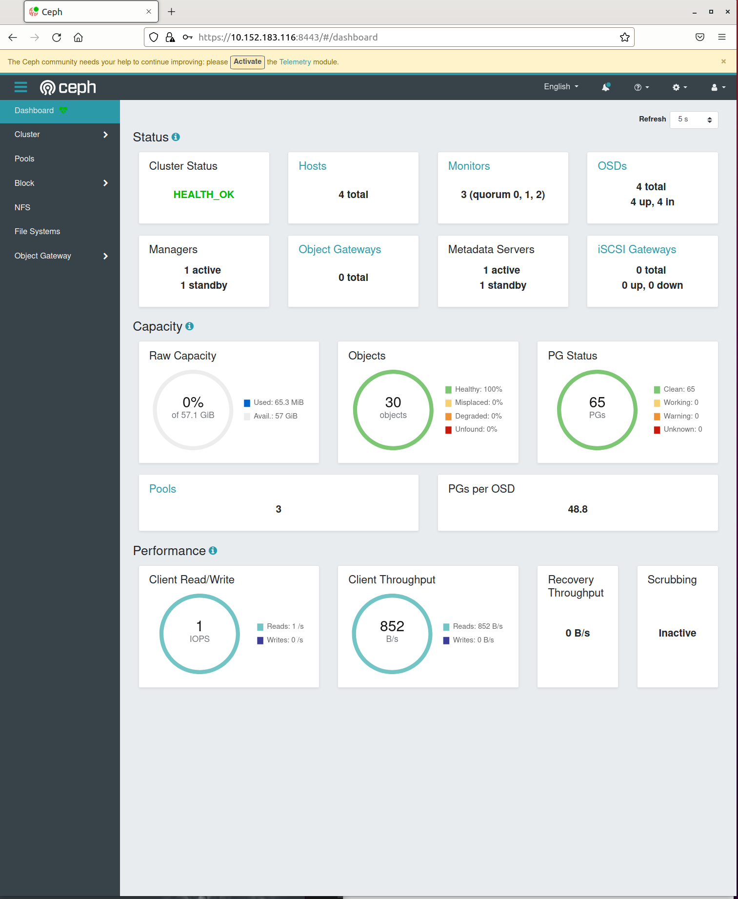
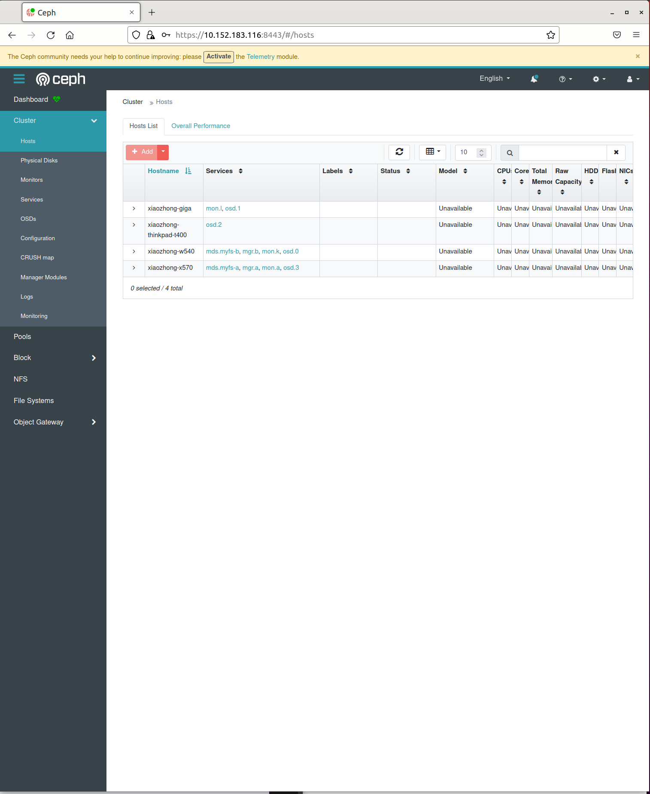

<div align="center">
  
  <br><br>
</div>

## <a id="preface"></a>Preface

A **Cluster** will be running if you just go through the **Practice** as this **Markdown** document introduces. Its **Major Features** include: 

**(1)**, It will be a **high-available** cluster, based on [Microk8s](https://microk8s.io/), which app can continuously run at even if some Host in the cluster gets failed. 

**(2)**, The cluster is cost-efficient to deploy, even if setup it at home.

**(3)**, It constructs a **Distributed File System (DFS)** by setting up a **Storage Cluster** running on [Ceph](https://ceph.io/en/) + [Rook](https://rook.io/) on Microk8s. It aims to reduce cost but not loose high-availability for the Storage Cluster. 

**(4)**, The app that we developed to verify the **DFS** working is a **Full-Stack web app**. So, it proves that the cluster can be visited from both LAN and <a id="visited-from-internet"></a> Internet (**as a Cloud**).  

The **Cluster/Cloud**-based app implements **CRUD (create, read, update, delete)** operations on files that browser requests to server. It is coded with [Express.js](https://expressjs.com) ([Node.js](https://nodejs.org)). According to **RESTful API** requirement, its browser app just requests server app to **Transfer** one **Representational State** to another: list/upload/download/delete files to/from/inside DFS of server. 

**(5)** At the end, all the resources to create, run, maintain a **Bare Metal** (the node to install cluster is a physical host other than virtual machine) and **On-premises** (you provide all running environment and resources other than renting them from other service providers) Cluster/Cloud. That is, at least, your won't have "excuse" to say that our operational system is impacted by outside world :-) 

<br>

# Table of Contents

## 1, [Setup Microk8s Cluster](#setup-microk8s-cluster) 

### 1.1, [Prepare Hosts](#prepare-hosts)

### 1.2, [Install Microk8s](#install-microk8s)

### 1.3, [Search package to complete Microk8s installation](#search-package)

### 1.4, [Enable addon "DNS"](#enable-dns)

### 1.5, [Enable addon "Ingress"](#enable-ingress)

### 1.6, [Enable addon "Metallb"](#enable-metallb)

### 1.7, [Set up HA cluster](#set-up-ha)

<br>

## 2, [Verify High Available Microk8s Cluster works](#verify-microk8s)

### 2.1, [Prepare an app based on docker-containers](#prepare-hello)

### 2.2, [Deploy the "Hello" app](#deploy-hello)

### 2.3, [Run "Hello" to verify HA](#run-hello)

### 2.4, [Verify how HA feature stops working](#verify-ha-stops)

### 2.5, [Microk8s Cluster get recovered to HA functionality](#verify-ha-back)

<br>

## 3, [Setup High Available Storage Cluster](#setup-storage-cluster)

### 3.1, [Designed ideas for Ceph + Rook](#ideas-ceph-rook)

### 3.2, [Setup Ceph-Rook platform (1): prepare environment for Storage Cluster](#prepare-env-storage-cluster)

### 3.3, [Prepare Raw Storage Devices](#prepare-raw-storage-device)

### 3.4, [Setup Ceph-Rook platform (2), create Storage Cluster](#create-storage-cluster)

### 3.5, [Setup Ceph-Rook platform (3), create DFS on Storage Cluster](#create-dfs)

### 3.6, [Verify DFS by direct mounting](#verify-dfs-direct-mounting)

### 3.7, [Setup Ceph-Rook platform (4), create PersistentVolumeClaim that app uses as a local directory](#create-pvc-as-local-dir)

<br>

## 4, [Develop/Deploy app "files" to use DFS](#deploy-files-2-use-dfs)

### 4.1, [Essential coupling between micro-services: Express.js app and DFS](#coupling-micro-services)

### 4.2, [Operations from browser to CRUD files at server](#browser-crud-server-files)

<br>

## 5, [Utilizing tools to verify working of Storage Cluster](#tools-2-verify-storage-cluster)

### 5.1, [Deploy Tools](#deploy-tools)

#### 5.1.1. [Deploy Rook Toolbox](#deploy-rook-toolbox)

#### 5.1.2. [Deploy Ceph Dashboard](#deploy-ceph-dashboard)

### 5.2, [Checking various statues of Storage Cluster](#check-statuses-4-storage-cluster)

#### 5.2.1, [Verify normal working status](#verify-normal-working)

#### 5.2.2, [What will happen if a host stops?](#host-stop) 

#### 5.2.3, [Status when problem node gets restored](#node-get-restored)

<br>

## 6, [To-dos](#to-dos)

<br>

## 7, [Summary](#smmary)

<br>

<a id="setup-microk8s-cluster"></a>

## 1, Setup **Microk8s Cluster**

<br>

Microk8s is a "minimal production [Kubernetes](https://kubernetes.io)". Kubernetes is a "**container orchestration system** for automating software deployment, scaling and management". 

According to technical theory and our practice, Micork8s plays a critical role as base of the whole system as:

**(1)**, It organizes system and app components as co-operative containers. The mechanism isolates the cluster from host system (hardwar/software) that it resides, so that it is much easier for us to develope and maintain our cluster on each host. For example, if some issue hurts Microk8s cluster on practice, we just need to fix it on container layer (or even re-install the cluster), but no need to touch host environment.

**(2)**, The app deployed on Microk8s as Kubernetes service, such as web app, can be visited from both LAN (**as cluster**) and Internet (**as Cloud**). That is, Microk8s establishes fundamental footstone, based on which you shall be able to implement a customized one on either local (enterpriser, building, house, and etc) or public (remote customers) scale.

<br>

<a id="prepare-hosts"></a>

### 1.1, Prepare Hosts

<br>

I **prepared** 4 PCs to construct the cluster. These are the **Hosts** that I just found at my storage (is it "cost-efficient"? :-) 

Their names are like below:

xiaozhong-x570,

xiaozhong-w540,

xiaozhong-giga,

xiaozhong-ThinkPad-T400.

You may use more hosts depending on your own case.

To access the cluster, another device may be needed to run a browser app, which is out of the cluster. On my trial, that is 1 more laptop or raspberry Pi 3B+ board which browser runs on. 

<br>

<a id="install-microk8s"></a>

### 1.2, Install Microk8s

<br>

On every **Host**, download our repository from github:

```
$ git clone https://github.com/huaxiaozhong1/practice-on-microk8s-ceph-rook-high-available-distributed-storage-cluster
$ cd practice-on-microk8s-ceph-rook-high-available-distributed-storage-cluster
```

Start to install Microk8s and necessary add-ons.

```
$ sudo snap install microk8s --channel=1.22/stable --classic 
```

The installation may get failed due to issue with network connection. On the case, you could download Microk8s packages at first.

```
$ sudo snap download microk8s --channel=1.22/stable
```

The version of microk8s running on my cluster is v1.22.9-3+b6876a8b1b090b. You could check it after Microk8s works.

```
$ microk8s kubectl version
```

The reversion that snap identifies is 3203. You could check it after Microk8s is installed.

```
$ sudo snap list microk8s
```

So, if your downloading is successful, you could find 2 more files are added on the folder: microk8s_3203.assert and microk8s_3203.snap. Run the following commands to install:

```
$ sudo snap ack microk8s_3203.assert
$ sudo snap install microk8s_3203.snap --classic
```

**Note:** 

(1) You may need to config your firewall to allow communication on cni0 (Container Network Interface as a bridge for all pods in a node):

```
$ sudo ufw allow in on cni0 && sudo ufw allow out on cni0 && sudo ufw default allow routed
```

(2) On worse case, the downloading may get stuck on installation. Then you could contact to me to get the 2 files from me :-) The snap package is too big to upload to my git repository. 

Now, please check status until "microk8s is running".

```
$ microk8s status
microk8s is running
high-availability: no
  datastore master nodes: 192.168.0.100:19001 
  datastore standby nodes: none
addons:
  enabled:
  disabled:
    ambassador  
...
```

Run the following command, to check if all elements have become "ready". Especially, the sign of "READY" of each pod turn to be "1/1". 

```
$ microk8s kubectl get all --all-namespaces
NAMESPACE        NAME                                          READY   STATUS    RESTARTS   AGE
kube-system      pod/calico-node-q94vg                         1/1     Running   0          3m
...
```

<br>

<a id="search-package"></a>

### 1.3, Search package to complete Microk8s installation.

<br>

During your installing either Microk8s cluster or addons, it may be short of some dependent packages so that the cluster won't work. At the moment, you need to search those packages. There are some ways or tricks to look for them over Internet.  

For example, it's probably that some pods are not ready after a long time, as below:

```
$ microk8s kubectl get all --all-namespaces
NAMESPACE        NAME                                          READY   STATUS    RESTARTS   AGE
kube-system      pod/calico-node-q94vg                         0/1     Running   0          3m
...
```

Then you need to run the following command to check "why":

```
$ microk8s kubectl describe pod/calico-node-q94vg -n kube-system
Name:                 calico-node-q94vg
Namespace:            kube-system
...
... failed to pull image "k8s.gcr.io/pause:3.1": ...
...
```

Running the following command can know where to get the docker package.

```
$ sudo docker search pause
NAME                                 DESCRIPTION                                     STARS               OFFICIAL            AUTOMATED
mirrorgooglecontainers/pause-amd64                                                   19                                      
...                                       
```

Pull package "pause:3.1":

```
$ sudo docker pull mirrorgooglecontainers/pause-amd64:3.1
$ sudo docker tag mirrorgooglecontainers/pause-amd64:3.1 k8s.gcr.io/pause:3.1
```

After getting the docker image, let's go through a **General Procedure** to transfer it to Microk8s. 

Save the docker image as a tarball.

```
$ sudo docker save k8s.gcr.io/pause:3.1 > pause.3.1.tar
```

Then, import the tarball into microk8s:

```
$ microk8s ctr image import pause.3.1.tar
```

Now, the READY of pod "calico-node-q94vg" should become "1/1" if you run "checking" as below:

```
$ microk8s kubectl get all --all-namespaces
NAMESPACE        NAME                                          READY   STATUS    RESTARTS   AGE
kube-system      pod/calico-node-q94vg                         1/1     Running   0          3m
...
```

If the pod still can't turn to "ready", stop/start microk8s as:

```
$ microk8s stop
$ microk8s start
```

Eventually it should be READY as "1/1". 

Now we have launched a fundamental framework of Microk8s cluster. Let's install some necessary addons at step 1.4 - 1.6.

**Note:** if you aren't able to find any way to get such necessary image from Internet, you could contact to me. I can share it with you :-)

<br>

<a id="enable-dns"></a>

### 1.4, Enable addon "DNS"

<br>

The addon **dns** is commonly required by other addons.

```
$ microk8s enable dns
...
$ microk8s status
...
$ microk8s kubectl get all --all-namespaces
NAMESPACE        NAME                                          READY   STATUS    RESTARTS   AGE
...
kube-system      pod/coredns-86f78bb79c-p554n                  1/1     Running   0          1m
...
```

Checking all elements' status as we did at step 1.2. When all elements reach READY as "1/1", go to step 1.5. 

<br>

<a id="enable-ingress"></a>

### 1.5, Enable addon "Ingress"

<br>

The addon will enable traffic to come into your Kubernetes cluster from outside.

```
$ microk8s enable ingress
```
As we did at step 1.2, check if the sign READY of the addon gets "1/1". 

```
$ microk8s status
...
$ microk8s kubectl get all --all-namespaces
...
```
<br>

<a id="enable-metallb"></a>

### 1.6, Enable addon [**Metallb**](#https://metallb.universe.tf/)

<br>

Kubernetes doesn't offer an implementation of network load balances(Services of type LoadBalancer). The implementation of network load balancers that Kubernetes ships with are all glue code that calls out to various IaaS (Infrastruture as a Service) platforms (GCP, AWS, Azure...). If you're not running on such a supported IaaS platform, **LoadBalancer** will remain in the **"pending" state** indefinitely when created!

It is MetalLB that offers such a network load balancer implementation to integrate with standard network equipment, so that **"External Service"** on bare-metal cluster can work similar to what was supported by GCP, AWS, Azure...

As result, when you **launch an app** at the cluster, it could be **open to external world** as "an IP address and an accessible port". The address/port doesn't match to any one on a physical host; they are address and port assigned and managed by the Microk8s Cluster that you have just created. 

Now checking your physical router, to know the IP-address-pool that was set for machines and devices to connect. On my case, I set the pool ranges from 192.168.0.100 to 192.168.168.0.199. So, the 4 hosts connected to the router have IPs as: 192.168.0.100 - 192.168.0.103.

Then, I would assign MetalLB an IP-address-pool as 192.168.0.120 - 192.168.0.127. So, the following command is typed:

```
$ microk8s enable metallb:192.168.0.120-192.168.0.127
```

Go through the similar way, that we went through previous steps, to check and guarantee the addon works. 

<br>

<a id="set-up-ha"></a>

### 1.7, Set up HA cluster

<br>

Select a node as **master node**. It is 192.168.0.100, on my case. Run the following command at the host:

```
$ microk8s add-node
From the node you wish to join to this cluster, run the following:
microk8s join 192.168.0.100:25000/0e15febd53956674e8962a5240f08c3d
...
```

At all other hosts, apply to join the cluster, run:

```
$ microk8s join 192.168.0.100:25000/0e15febd53956674e8962a5240f08c3d
...
```

Checking status by running after add all 4 nodes into the cluster:

```
$ microk8s status
microk8s is running
high-availability: yes
  datastore master nodes: 192.168.0.100:19001 192.168.0.101:19001 192.168.0.102:19001
  datastore standby nodes: 192.168.0.103:19001
...
```

It shows that there have been 3 **"datastore master nodes"** in this HA cluster. And there is 1 more node as **"datastore standby node"**.

As mentioned at steps above, you still need to check every elements' states so that we could know if all components in the cluster work normally.

```
$ microk8s kubectl get all --all-namespaces
...
```

At the time, you can also check all nodes' status by run:

```
$ microk8s kubectl get no
NAME                      STATUS   ROLES    AGE   VERSION
xiaozhong-x570            Ready    <none>   1d    v1.22.9-3+b6876a8b1b090b
xiaozhong-w540            Ready    <none>   1d    v1.22.9-3+b6876a8b1b090b
xiaozhong-giga            Ready    <none>   1d    v1.22.9-3+b6876a8b1b090b
xiaozhong-ThinkPad-T400   Ready    <none>   1d    v1.22.9-3+b6876a8b1b090b
```
On my case, the 4 hosts are all READY, at the end.

<br>

<a id="verify-ha"></a>

## 2, Verify **High Available** Microk8s Cluster works.

<br>

<a id="prepare-hello"></a>

### 2.1, Prepare an app based on docker-containers

<br>

**A**s soon as the **"Multiple Nodes"** cluster is setup, how could we make sure "High Availability" functionality takes effect on it? 

**--** We have developed a simple "test" app for the purpose.  

On my Ubuntu 20.04 machines, docker.io is installed. Let's code a docker container app, called as **"Hello"**, to verify that the Microk8s Cluster is working.  

Run the following commands at every node, to create the app for each host. Or, you could build it in one host, scp it to other hosts.  

```
$ cd practice-on-microk8s-ceph-rook-high-available-distributed-storage-cluster/hello
$ sudo docker build -t hello.local .
...
```

A local docker image, which is named as "hello:local", is created. 

Save the image as a tarball:

```
$ sudo docker save hello:local > hello.local.tar
```

The procedure may need a few minutes.

<br>

<a id="deploy-hello"></a>

### 2.2, Deploy the **"Hello"** app.

<br>

We have built a web app at step 2.1. Now let's deploy it.

```
$ microk8s kubectl create deployment hello --image=hello:local
...
$ microk8s kubectl scale deployment hello --replicas=4
...
$ microk8s kubectl expose deployment hello --port=8081 --target-port=8080 --type=LoadBalancer --name=hello
...
```

After the 3 commands get done, check the status of service expose as above:

```
microk8s kubectl get all --all-namespaces
...
NAMESPACE   NAME                 TYPE           CLUSTER-IP       EXTERNAL-IP     PORT(S)          AGE
default     service/kubernetes   ClusterIP      10.152.183.1     <none>          443/TCP          11d
default     service/hello        LoadBalancer   10.152.183.185   192.168.0.120   8081:31305/TCP   1m
...
```

Now we know that the **Kubernetes Service** **"Hello"** could be visited via external IP (192.168.0.120 on port 8081) from devices out of the cluster.

<br>

<a id="run-hello"></a>

### 2.3, Run "Hello" to verify HA.

<br>

Let's go to a device. The device is connected to the same router that cluster's all hosts are connected to, but doesn't join the Microk8s Cluster. Run the following command at Command-Line terminal (**CLI**) of the device:

```
$ curl http://192.168.0.120:8081
Hello World
```

The **Hello** app shall reply terminal as: "Hello World". You could define other response by modifying the code at hello/server.js:

```
  res.send('Hello World \n');
```

**L**et's **power off** 192.168.0.100, the current **"master node (host: xiaozhong-x570)"** we selected while constructing the cluster. 

Then, check cluster status again from any other host that is still working, after xiaozhong-x570 is shutdown:

```
$ microk8s status
microk8s is running
high-availability: yes
  datastore master nodes: 192.168.0.101:19001 192.168.0.102:19001 192.168.0.103:19001
  datastore standby nodes: none
...
```

Now we witness that **the Microk8s Cluster is working continuously even if the original "master" node is shutdown!**

Try to access app "hello", from the external device, via 192.168.0.120 (with port 8081) again:

```
$ curl http://192.168.0.120:8081
Hello World
```

It is verified that the app's IP, exposed by cluster, does continuously work. It is not influenced with the original "master" node stops working.

<br>

<a id="verify-ha-stops"></a>

### 2.4, Verify how HA feature stops working.

As for the remained 3 nodes, let's turn off 1 more node. That is, only 2 nodes are working. At the moment, run command below again:

```
$ curl http://192.168.0.120:8081
```

No any response will come.

Now we are sure that the URL stops the response to browser request any more. Now it is verified that HA feature will be lost when the number of working nodes inside the cluster get less than 3.

<br>

<a id="verify-ha-back"></a>

### 2.5, Microk8s Cluster get recovered to HA functionality. 

Power on a node, wait for it back to work automatically. The status shall be as below after 3 nodes work in the cluster:

```
$ microk8s status
microk8s is running
high-availability: yes
  datastore master nodes: 192.168.0.101:19001 192.168.0.102:19001 192.168.0.103:19001
  datastore standby nodes: none
...
```

Then, run browser, the response shall come as below:

```
$ curl http://192.168.0.120:8081
Hello World
```

The response comes back from our web server app side. 

Now we know that the URL comes back to us when there are 3 nodes back to work.

Turn on the 4th host, as well, and wait the following checking to show all pods running again. 

```
$ microk8s status
microk8s is running
high-availability: yes
  datastore master nodes: 192.168.0.101:19001 192.168.0.102:19001 192.168.0.103:19001
  datastore standby nodes: 192.168.0.100:19001
...
```

```
$ microk8s kubectl get all --all-namespaces
...
```

<br>

<a id="setup-storage-cluster"></a>

## 3, Setup **High Available Storage Cluster**.

<br>

Now we know how to get a **Microk8s (Kubernetes) Cluster** working **Without Pausing**. An app can be containerized to run on the platform and with support by multiple hosts to achieve **High Available** functionalities, such as, **Continued Service** and **Load Balancing**. For example, the **External Service** with type  **LoadBalance** will continuously work when some node fails, only if the remaining nodes in cluster is not less than a certain number. 
 
**B**ut a Kubernetes cluster (e.g., Microk8s one) doesn't bring us **HA Storage System** naturally. For example:

**if** you plan to deploy an app that is capable for CRUDing files in **the Cluster** other than at a specific host;

**if** you hope that the system keeps such CRUD operations working without pausing even if some hosts get failed;

**--** much more construction needs to be done in the system.

**--** As a solution, you need to install a full **Distributed File System (DFS)** in the Microk8s Cluster. 

The **DFS** I am going to implement is based on Ceph + Rook.

<br>

<a id="ideas-ceph-rook"></a>

### 3.1, Designed ideas for Ceph + Rook.

<br>

**Ceph** is a **software-defined storage platform** that provides interfaces for object-, block- and file-level storage. In this system, we will utilize one of the interfaces -- DFS. 

The storage platform (or **Storage Cluster**) doesn't exist if only a Kubernetes cluster is installed. In this system, we choose **Rook** that eventually provisions our app a set of apis to work with DFS. For example, Rook inokes a standard Kubernetes' layer to interact with Ceph's DFS, which is **Persistent Volume Classification (PVC)**. Then, the **Volume** can be mounted as a **"folder"** in normal file system, so that an app could upload a file to and download it from the folder. 

There is a interesting fact: our app, via DFS, just puts files into and gets them from a "normal" folder; but it is no need for app to take care where and how the DFS exists and works.  

From next sessions, let's introduce the whole procedure to setup such a **Storage Cluster** or **DFS**. 

<br>

<a id="prepare-env-storage-cluster"></a>

### 3.2, Setup Ceph-Rook platform (1): prepare environment for **Storage Cluster**. 

<br>

Go to upper level directory that is at the same level of "practice-on-microk8s-ceph-rook-high-available-distributed-storage-cluster", to download git repository for Rook, 

```
$ git clone https://github.com/rook/rook.git
$ cd ceph/rook/deploy/examples
```

In directory "ceph/rook/deploy/examples", execute 2 **YAML (Yet Another Markup Language)** files to create related **Customer Resource Definition (CRD)** and **Common Resource**, which are necessary parts for a typical Kubernetes Cluster.

```
$ microk8s kubectl create -f crds.yaml
$ microk8s kubectl create -f common.yaml
```

Consequently, change 2 line in **operator.yaml**, then run it. The yaml is to add all necessary operators to setup the Storage Cluster in the Cluster.

```
ROOK_CSI_KUBELET_DIR_PATH: "/var/snap/microk8s/common/var/lib/kubelet"
...
# Whether to start the discovery daemon to watch for raw storage devices on nodes in the cluster.
ROOK_ENABLE_DISCOVERY_DAEMON: "true"
```

Here **ROOK_CSI_KUBELET_DIR_PATH** is directory path for kubelet. It is /var/snap/microk8s/common/var/lib/kubelet if Microk8s has been installed.

The **ROOK_ENABLE_DISCOVERY_DAEMON** is a configuration setting for Rook. If it is true, the execution of operator.yaml will create **Discovery Daemon** (a pod) one per one node (Host). One mission of these pods is to find **Raw Storage Device** one per host, which the **OSD (Object Storage Daemon)** created by execution of cluster.yaml needs to consume data on. 

Here is the means to prepare Raw Storage Device.

<br>

<a id="prepare-raw-storage-device"></a>

### 3.3, Prepare **Raw Storage Devices**

<br>

The kind of **Raw Storage Device** requires an individual disk partition on each node. You could check if an **empty** partition exists.

```
$ lsblk -f

NAME                  FSTYPE      LABEL UUID                                   MOUNTPOINT
vda
└─vda1                LVM2_member       >eSO50t-GkUV-YKTH-WsGq-hNJY-eKNf-3i07IB
 ├─ubuntu--vg-root   ext4              c2366f76-6e21-4f10-a8f3-6776212e2fe4   /
 └─ubuntu--vg-swap_1 swap              9492a3dc-ad75-47cd-9596-678e8cf17ff9   [SWAP]
vdb
```

If, at each host, the attribute FSTYPE is empty, it means the partition is empty. Then we could start next session. 

If, at a host, there is **no Empty** disk partition (for example, the whole disk space has been occupied by some file systems), then you have to find a way to get a little space for the **Raw Storage Device**. The way could be to add 1 more physical hard disk, or shrink the current disk partitions by using some tools, such as resize2fs. 

If there is a partition that is not empty but can be cleaned up (e.g., its **FSTYPE** has been set as ext4 or some others), then you could find **disk-clean.sh** from my repository, to erase all the data in the partition and clean it up. 

You could find a similar line in this shell script: 

```
DISK="/dev/vdb"
```
 
Re-assign the **DISK** as a partition name, the partition that you plan to create our DFS on. 

Then:

```
sudo sh disk-clean.sh
...
```

After you succeed in creating the Raw Storage Devices in every node, go to **--**

<br>

<a id="create-storage-cluster"></a>

### 3.4, Setup Ceph-Rook platform (2), create Storage Cluster. 

<br>

It's time to run operator.yaml that we prepared on Section 3.2:

```
$ microk8s kubectl create -f operator.yaml
configmap/rook-ceph-operator-config created
deployment.apps/rook-ceph-operator created

$ microk8s kubectl get all -n rook-ceph
NAME                                      READY   STATUS    RESTARTS   AGE
pod/rook-ceph-operator-757546f8c7-6jl8q   1/1     Running   0          54s
pod/rook-discover-4n6np                   1/1     Running   0          39s
pod/rook-discover-f7xr4                   1/1     Running   0          39s
pod/rook-discover-7n8ss                   1/1     Running   0          39s
pod/rook-discover-8sf7q                   1/1     Running   0          39s

NAME                           DESIRED   CURRENT   READY   UP-TO-DATE   AVAILABLE   NODE SELECTOR   AGE
daemonset.apps/rook-discover   4         4         4       4            4           <none>          40s

NAME                                 READY   UP-TO-DATE   AVAILABLE   AGE
deployment.apps/rook-ceph-operator   1/1     1            1           54s

NAME                                            DESIRED   CURRENT   READY   AGE
replicaset.apps/rook-ceph-operator-757546f8c7   1         1         1       54s

```

Now we could find: **Namespace** "rook-ceph" is created. And its first members include 4 **Discovery Pod**s, which will find each **Empty Partition** we have prepared for the finding in Section 3.3. 

Now it's the time to create **Storage Cluster**, by running cluster.yaml. 

After the manifest file is executed, **4 OSD** pods will work. These Ceph OSD daemons store most of Ceph's data. Usually each OSD works with a single **Storage Device**, which Discovery Pod has found during execution of operator.yaml, on our case.

During its launching, OSD daemon will call a tool **ceph-volume**. The command will determine a **Strategy** (or called as **Storage Backend"** that is **Bluestore**, on our case) on how to consume data on the **Storage Device**. 

You could run the following command again after OSDs are created:

```
$ lsblk -f

NAME                  FSTYPE      LABEL UUID                                   MOUNTPOINT
vda
└─vda1                LVM2_member       >eSO50t-GkUV-YKTH-WsGq-hNJY-eKNf-3i07IB
 ├─ubuntu--vg-root   ext4              c2366f76-6e21-4f10-a8f3-6776212e2fe4   /
 └─ubuntu--vg-swap_1 swap              9492a3dc-ad75-47cd-9596-678e8cf17ff9   [SWAP]
vdb                  ceph_bluestore
```

We are told that the vdb has been **Formatted** the **Filesystem Type** as **ceph_bluestore**, which OSD daemon accepts and would consume data on.

Along with OSD, 2 other type of Ceph daemons: **Ceph-MON** daemon (monitoring status of Ceph distributed file system) and **Ceph-MGR** (providing interfaces to management and additional/external management for Cluster) are worthy of notice. 

Now, change count of MGR daemon to 2 but keep count of MON daemon  as 3 in cluster.yaml:

```
  mon:
  ...
    count: 3
  ...
  mgr:
  ...
    count: 2
```

Run:

```
$ microk8s kubectl create -f cluster.yaml
cephcluster.ceph.rook.io/rook-ceph created
...
```

The procedure needs a while to have everything done. You could keep checking:

```
$ microk8s kubectl -n ceph-rook get pod
...
rook-ceph-osd-1-5fdcb9fd-8th5r                                    1/1     Running     2 (3h35m ago)    7d9h
rook-ceph-osd-0-79c64598c8-csxcv                                  1/1     Running     6 (3h35m ago)    9d
rook-ceph-osd-3-59797b77c9-5hzld                                  1/1     Running     3 (3h33m ago)    7d23h
rook-ceph-osd-2-6d75df4b44-2pqcx                                  1/1     Running     5 (5d10h ago)    9d
rook-ceph-mon-f-69668bdf7f-rlnz5                                  1/1     Running     3 (3h52m ago)    7d10h
rook-ceph-mon-g-5c75bcb898-mx4ms                                  1/1     Running     4 (3h54m ago)    7d23h
rook-ceph-mon-e-fcb6f98bd-llfbj                                   1/1     Running     5 (5d11h ago)    8d
rook-ceph-mgr-b-8655f8d98f-tlcx6                                  2/2     Running     5 (3h55m ago)    7d10h
rook-ceph-mgr-a-7849b47fd8-w9m6v                                  2/2     Running     11 (5d11h ago)   9d
...
```

until all pods of namespace ceph-rook enter the status **running** as above.

At the time, you could find that **3 kind of critical pods** (daemons) are working as we set.

**4 OSD** pods are working, 1 of which works on 1 node. So there are 4 OSDs totally running since our Storage Cluster is comprised of 4 nodes (hosts) totally :-)

Also, you could find that 3 **MON (Monitor)** pods and 2 **MGR (Manager)** pods are created, which we set in cluster.yaml. 

We will verify whether and how these pods work to construct a **HA (High Available)** Storage Cluster in the sessions later. 

<br>

<a id="create-dfs"></a>

### 3.5, Setup Ceph-Rook platform (3), create DFS on Storage Cluster. 

<br>

On the **OSDs** created, we could create **DFS** by calling:

```
$ microk8s kubectl create -f filesystem.yaml 
cephfilesystem.ceph.rook.io/myfs created
...
$ microk8s kubectl get pod -n rook-ceph
...
csi-cephfsplugin-b8pgr                                            3/3     Running     18 (7h7m ago)   9d
csi-cephfsplugin-kbrkl                                            3/3     Running     21 (7h7m ago)   9d
csi-cephfsplugin-2vk4g                                            3/3     Running     21 (7h8m ago)   9d
csi-cephfsplugin-f47n2                                            3/3     Running     18 (7h7m ago)   9d
rook-ceph-mds-myfs-a-6db97f6fc9-4sbwm                             1/1     Running     7 (7h6m ago)    9d
rook-ceph-mds-myfs-b-54554c7574-84c7h                             1/1     Running     7 (7h3m ago)    8d
...
```

Related to each OSD pod, a **CSI (Container Storage Interface)** pod (called as csi-cephfsplugin-xxx) is created. They provide Kubernetes stands interface to call DFS from each orchestrated container.

Here the name of DFS is **"myfs"**, as we define in filesystem.yaml:

```
kind: CephFilesystem
metadata:
  name: myfs
```

Another 2 more pods are called as MDS (**Metadata Server** daemon for Ceph DFS). These are 1 active pod and 1 standby pod, as filesystem.yaml sets:

```
  metadataServer:
  ...
    activeCount: 1
  ...
    activeStandby: true

```

On coming sessions, we will know how these critical pods work together, to provide **REAL** storage usage. 

<br>

<a id="verify-dfs-direct-mounting"></a>

### 3.6, Verify **DFS** by mounting it directly.

<br>

Right after creating DFS, you could verify by mounting it directly:

```
$ microk8s kubectl create -f direct-mount.yaml 
deployment.apps/rook-direct-mount created
$ microk8s kubectl -n rook-ceph get deploy | grep direct
rook-direct-mount                                  1/1     1            1           1h

$ microk8s kubectl -n rook-ceph exec -it deploy/rook-direct-mount -- bash
[root@xiaozhong-giga /]# 
```

Now, in the app:

```
# mon_endpoints=$(grep mon_host /etc/ceph/ceph.conf | awk '{print $3}')
# my_secret=$(grep key /etc/ceph/keyring | awk '{print $3}')
# mount -t ceph -o mds_namespace=myfs,name=admin,secret=$my_secret $mon_endpoints:/ /mnt
# ls -R /mnt
/mnt:
volumes

/mnt/volumes:
_csi:csi-vol-c09ac3d3-b4d5-11ec-ba3f-9a881383e434.meta	csi

/mnt/volumes/csi:
csi-vol-c09ac3d3-b4d5-11ec-ba3f-9a881383e434

/mnt/volumes/csi/csi-vol-c09ac3d3-b4d5-11ec-ba3f-9a881383e434:
6a38aa51-57f7-4dd3-8674-6ba056e052f8

/mnt/volumes/csi/csi-vol-c09ac3d3-b4d5-11ec-ba3f-9a881383e434/6a38aa51-57f7-4dd3-8674-6ba056e052f8:

```

**Notice**: the command **mount** has a **-o (--option)** parameter as **mds_namespace=myfs**, meaning: the operation is going to **mount DFS "myfs"**.

As result, we get proved: **1)**, the **DFS, myfs**, has been mounted successfully; **2)**, there are a 5-layer folder inside myfs.

We will observe how an app manipulates contents to/from myfs, such as, list/upload/download/delete files.

<br>

<a id="create-pvc-as-local-dir"></a>

### 3.7, Setup Ceph-Rook platform (4), create PersistentVolumeClaim that app uses as a local directory.

<br>

Until now, we have created a **Storage Cluster** called as rook-ceph. A **DFS** (called as myfs), can be mounted and visited by a **user account as root** from **a pod inside the cluster**. 

However the way we are not able to CRUD files in the DFS from app (e,g from browser) out of the cluster.

To do so, thanks for Kubernetes to provision a **standard mechanism**, follow which an app could use the **DFS** as folder of normal file system. 

Let's go.

Create **Storage Class** by calling:

```
$ microk8s kubectl create -f csi/cephfs/storageclass.yaml
storageclass.storage.k8s.io/rook-cephfs created 
```

Pay attention at storageclass.yaml:

```
...
kind: StorageClass
metadata:
  name: rook-cephfs
...
  # CephFS filesystem name into which the volume shall be created
  fsName: myfs
...
```

The command creates **Storage Class**, rook-cephfs, based on **myfs**.

A PersistentVolume (PV) is a piece of storage in the cluster that has been provisioned by an administrator or dynamically provisioned using **Storage Classes** (a Kubernetes convention to define "a class" of storage).

In Kubernetes mechanism to manage storage, **Persistent Volume (PV)** represents a piece of storage that has been provisioned using Storage Classes. A **PersistentVolumeClaim (PVC)** is a request for storage, which an app could call through to CRUD files eventually. 

Right after executing storage.yaml, set **accessModes** in pvc.yaml:

```
...
spec:
  accessModes:
    - ReadWriteMany
...
```

Running the manifest file:

```
$ microk8s kubectl create -f pvc.yaml
persistentvolumeclaim/cephfs-pvc created 
```

a **PVC**, whose name is **cephfs-pvc** on our case, will be created. Mounting it just as a **Normal Directory inside pod**, any normal app could CRUD files under the directory. 

Now, thanks for the series of **Kubernetes Standard Interface**s: DFS -> Storage Class -> PV -> PVC, a normal app is able to use the **Ceph DFS**.

<br>

<a id="deploy-files-2-use-dfs"></a>

## 4, Develop/Deploy app "**files**" to use **DFS**.

<br>

The framework of "**files**" is based on express.js, de facto standard framework for Node.js. And the latter is a full-stack framework for web app developement. We could think it as creating 2 applications once: **web server app** and **web browser app**. 

<br>

<a id="coupling-micro-services"></a>

### 4.1, Essential coupling between micro-services: **Express.js app** and **DFS**.

<br>

Go back to directory "practice-on-microk8s-ceph-rook-high-available-distributed-storage-cluster", then enter its sub-folder:

```
$ cd express-js-files
```

Under the folder, we could develop and deploy **files**, which is to CRUD files in DFS. 

The app, developed with the codes inside directory, generates a docker container image, which Microk8s can import. The app doesn't only include its own application source, but also packs up the dependent environment and components, such as, node.js, express.js, along with packages that node.js requires, like multer for file operation, and etc. 

All the software stuffs along with building procedure create a set of components according to  Microk8s (Kubernetes) framework, such as, pods, deployments, services. Let's notice a line in files-deploy.yaml:

```
    spec:
      containers:
      ...
        volumeMounts:
          - name: hello-persistent-storage
            mountPath: /usr/src/app/uploads
      volumes:
        - name: hello-persistent-storage
          persistentVolumeClaim:
            claimName: cephfs-pvc```
```

Here the yaml mounts **cephfs-pvc** (claimName of PVC) to **/usr/src/app/uploads** (a directory in the pod to put/get file into/from). 

The way a **loose couple** is created between the **express.js app** (**a micro-service**) and **DFS** (**other micro-services**).

<br>

<a id="browser-crud-server-files"></a>

### 4.2, Operations from browser to CRUD files at server.

<br>

Inside the directory: **express-js-files**, build docker container image:

```
$ docker build -t files .
$ docker save files > files.local.tar

```

Import the image into Microk8s.

```
$ microk8s ctr image import files.local.tar
```

Deploy the **Express.js (Node.js) app** from **Docker container image** as a service of **Microk8s (Kubernetes)** cluster.

```
$ microk8s kubectl create -f files-deploy.yaml
$ microk8s kubectl create -f files-service.yaml
```

Check the results.

```
$ microk8s kubectl get all | grep files
pod/files-deployment-85d8b99b9-5xccq   1/1     Running   16             19d
pod/files-deployment-85d8b99b9-mjnqx   1/1     Running   16 (82m ago)   19d
pod/files-deployment-85d8b99b9-67tcw   1/1     Running   14 (83m ago)   15d
pod/files-deployment-85d8b99b9-qbhfx   1/1     Running   16 (82m ago)   19d
service/files        LoadBalancer   10.152.183.172   192.168.0.121   18080:30529/TCP   19d
deployment.apps/files-deployment   4/4     4            4           19d
replicaset.apps/files-deployment-85d8b99b9   4         4         4       19d

```

Knowing from the messages, the **URL**

```
http://192.168.0.121:18080/
```

is a public IP address and port that user could call from outside to access the app (a virtual service, other than to an IP address/port at specfic pod or node or host).

Following the address and port, some parameters can also be input, according to the design of Express.js. With the parameter, server app will select a specfic operation to run.

On our app, operations following these parameters are coded:

**(1),** http://192.168.0.121:18080/upload: upload local files to server.

When the request is sent to server, such a page will be displayed on browser (firefox):

<div align="center">
  
  <br><br>
</div>

Pressing "Browser" button, select a local file on the coming pop-up dialog box, press "Upload File" then.

As soon as server receives/stores the file, a message will display on your browser:

```
"File is uploaded"
```

**(2),** Is the file really uploaded to DFS?

Let's verify via app ("rook-direct-mount") that we launched at [Section 3.6](#verify-dfs-direct-mounting):

```
# ls -Rl /mnt
/mnt:
total 0
drwxr-xr-x 3 root root 2 Apr 28 02:10 volumes

/mnt/volumes:
total 0
-rwxr-xr-x 1 root root 0 Apr 28 02:10 _csi:csi-vol-5667296c-c698-11ec-b90d-8a403445a73c.meta
drwxr-xr-x 3 root root 1 Apr 28 02:10 csi

/mnt/volumes/csi:
total 0
drwxrwxrwx 3 root root 2 Apr 28 02:10 csi-vol-5667296c-c698-11ec-b90d-8a403445a73c

/mnt/volumes/csi/csi-vol-5667296c-c698-11ec-b90d-8a403445a73c:
total 0
drwxrwxrwx 2 root root 2 May 11 07:32 4001fea4-e13a-47a3-9c20-8ff9deeb141f

/mnt/volumes/csi/csi-vol-5667296c-c698-11ec-b90d-8a403445a73c/4001fea4-e13a-47a3-9c20-8ff9deeb141f:
total 48
-rw-r--r-- 1 root root 22782 Apr 29 11:05 daisy.jpg
-rw-r--r-- 1 root root 25499 May 11 07:32 dandelion.jpg
```

-- **the last 2 lines** show that 2 files that we have just uploaded are stored inside DFS really. 

**(3),** http://192.168.0.121:18080/files: list and download files that exist in server. 

If you are using **Firefox** browser, such a page shall display when the above request is sent to server:

<div align="center">
  
  <br><br>
</div>

Move mouse onto a url, press right button, select **Save link as** on the pop-up dialog window, select a local directory to download the file from server side. 

If you are using **Chrome** browser (on PC, for example) or **Chromium** browser (on Raspberry Pi, for example), then a different tab may display on your browser:

<div align="center">
  
  <br><br>
</div>

On the case, just select a url (the blue part on screenshot), copy and paste it on url column of a new tab. Requesting the url, we could download the file from server to local directory. 

**(4),** http://192.168.0.121:18080/delete: delete file that is stored in server.

When the request is sent to server, such a page shall display on browser:

<div align="center">
  
  <br><br>
</div>

Supposing on Firefox browser, you could select a url that includes the file to delete in server, press it. The file shall be deleted at server side quickly, then responds the message:

```
message	"The file has been deleted. "
```

**Note**: If you use Chrome/Chromium browser, following the similar steps that we introduced at Step 4.2.(3), you could also delete the file, as well.

Now we have got a **test app**, **a tool**, to run **CRUD** operations for files at server side. All the operations can be done from browsers out of cluster.

<br>

<a id="tools-2-verify-storage-cluster"></a>

## 5, Utilizing tools to verify working of Storage Cluster.

<br>

The discussion focus on two tools that can monitor near-real-time status of the Storage Cluster. 

CLI tool -- Rook ToolBox, and 

GUI (Graphical User Interface) tool -- Ceph Dashboard.

<br>

<a id="deploy-tools"></a>

### 5.1, Deploy Tools.

<br>

<a id="deploy-rook-toolbox"></a>

#### 5.1.1. Deploy **Rook Toolbox**.

<br>

Change "working directory" to ceph/rook/deploy/examples, modify 1 line in toolbox.yaml:

```
  replicas: 4
```

Run command below:

```
$ microk8s kubectl create -f toolbox.yaml
$ microk8s kubectl get all --all-namespaces| grep tool
rook-ceph        pod/rook-ceph-tools-555c879675-4pggx                                  1/1     Running     12 (7h13m ago)    13d
rook-ceph        pod/rook-ceph-tools-555c879675-nbgww                                  1/1     Running     9 (7h12m ago)     12d
rook-ceph        pod/rook-ceph-tools-555c879675-qdq8j                                  1/1     Running     12 (7h12m ago)    13d
rook-ceph        pod/rook-ceph-tools-555c879675-sx5gw                                  1/1     Running     10 (7h12m ago)    12d
rook-ceph        deployment.apps/rook-ceph-tools                                    4/4     4            4           13d
rook-ceph        replicaset.apps/rook-ceph-tools-555c879675                                    4         4         4       13d
microk8s kubectl -n rook-ceph exec -it deploy/rook-ceph-tools -- bash
[rook@rook-ceph-tools-555c879675-4pggx /]$ 
```

By executing the deployment (app), we have entered a pod of the deployment. 

Typing [CLI commands](https://docs.ceph.com/en/latest/rados/operations/monitoring/#monitoring-a-cluster) in the pod, to look at how the **Tool** works:

<a id="verify_Rook_Toolbox"></a>

```
[rook@rook-ceph-tools-555c879675-4pggx /]$ $ ceph status
  cluster:
    id:     594241e6-e8af-4260-bb80-13826d6c6ac8
    health: HEALTH_OK
 
  services:
    mon: 3 daemons, quorum e,f,g (age 7h)
    mgr: b(active, since 7h), standbys: a
    mds: 1/1 daemons up, 1 hot standby
    osd: 4 osds: 4 up (since 7h), 4 in (since 13d)
 
  data:
    volumes: 1/1 healthy
    pools:   3 pools, 65 pgs
    objects: 31 objects, 465 KiB
    usage:   89 MiB used, 57 GiB / 57 GiB avail
    pgs:     65 active+clean
 
  io:
    client:   853 B/s rd, 1 op/s rd, 0 op/s wr
```

The commmand reprte that there are 4 OSDs, 3 MON daemons, 2 MGR deamons and 2 MDS daemons work, whcih all just fit to what we set at the previous sections: 

Section **3.2** for OSD setting;

Section **3.4** for MON and MGR settings;

Section **3.5** for MDS setting.

So, these messages tell us that the Rook Toolbox works well now.

<br>

<a id="deploy-ceph-dashboard"></a>

#### 5.1.2. Deploy **Ceph Dashboard**.

<br>

Run command:

```
$ microk8s kubectl -n rook-ceph get service
...
rook-ceph-mgr-dashboard    ClusterIP   10.152.183.116   <none>        8443/TCP            3d5h
...
```

The service ("rook-ceph-mgr-dashboard") is called **Ceph Dashboard**, which aims to timely report status of the **Storage Cluster** in GUI mode. 

On browser, type url:

```
https://10.152.183.116:8443
```

A page shall display on browser:

<div align="center">
  
  <br><br>
</div>

Get admin's password via the following way:

```
$ microk8s kubectl -n rook-ceph get secret rook-ceph-dashboard-password -o jsonpath="{['data']['password']}" | base64 --decode && echo
Fz$~';6n.UUy2?WZiR1T
```

Paste the password onto column "password" on browser. A page shall display as soon as you press button "Login":

<div align="center">
  
  <br><br>
</div>

If you look through the status information, some of which are same to what we got from [Rook Toolobx](#verify_Rook_Toolbox).

So, now we could be quite confident that the Ceph Dashboard is ready to work.

<br>

<a id="check-statuses-4-storage-cluster"></a>

### 5.2, Checking various statues of Storage Cluster.

<br>

<a id="verify-normal-working"></a> 

#### 5.2.1, Verify normal working status. 

<br>

Run:

```
$ microk8s status
microk8s is running
high-availability: yes
  datastore master nodes: 192.168.0.100:19001 192.168.0.101:19001 192.168.0.102:19001
  datastore standby nodes: 192.168.0.103:19001
...
```

That means all nodes are working well, so is Microk8s Cluster.

You could also check status for Storage Cluster via Rook Toolbox:

```
$ microk8s kubectl -n rook-ceph exec -it deploy/rook-ceph-tools -- bash
[rook@rook-ceph-tools-555c879675-4pggx /]$ ceph status
  cluster:
    id:     594241e6-e8af-4260-bb80-13826d6c6ac8
    health: HEALTH_OK
 
  services:
    mon: 3 daemons, quorum e,f,g (age 26m)
    mgr: b(active, since 32m), standbys: a
    mds: 1/1 daemons up, 1 hot standby
    osd: 4 osds: 4 up (since 27m), 4 in (since 2w)
...
[rook@rook-ceph-tools-555c879675-4pggx /]$ ceph mgr stat
{
    "epoch": 223,
    "available": true,
    "active_name": "b",
    "num_standby": 1
}
[rook@rook-ceph-tools-555c879675-4pggx /]$ ceph mds stat
myfs:1 {0=myfs-b=up:active} 1 up:standby-replay
```

Along with the information that we got at Section [5.1.1](#verify_Rook_Toolbox), all the status information shows that **Storage Cluster** is working well. Its main deamons are also working well: 4 OSDs with 1 per node, 3 MONs working as we set, 1 MGR (mgr.b) as active and the other (mgr.a) as standby, 1 MDS (myfs-b) up and 1 more (myfs-a) hot-standby. 

**Let's** go back to last browser page we got above, to start getting status information of Storage Cluster via Ceph Dashboard.

On the page, select **Cluster -> Hosts**, the browser shall displays as:  

<div align="center">
  
  <br><br>
</div>

From the page, we could know: which daemons are working on which host. 

**For example**, at xiaozhong-w540, there are a **MDS** daemon (mds.myfs-b), a **MGR** daemon (mgr.b), a **MON** daemon (mon.b) and an **OSD** daemon (osd.0) running.

We could monitor some type of daemon status via more ways. For example, select **Cluster -> OSDs**, the page display as below:

<div align="center">
  
  <br><br>
</div>

It shows: osd.0 has joined **in** the cluste and taken **up** xiaozhong-w540, which has disk space 11.2GB... 

**"Files"**, the test app we developed, could also be used to verify if all CRUD operations work at the moment.

<br>

<a id="host-stop"></a> 

#### 5.2.2, What will happen if a host stops? 

<br>

Now let's power xiaozhong-w540 off, to simulate that some issue occurs with the host. As soon as it is dead, the OSDs status of dashboard will display as:

<div align="center">
  
  <br><br>
</div>

It shows that Host xiaozhong-w540 is still **in** the cluster but is shut **down**. Now there are only 3 OSD nodes working in the cluster. 

At the moment, if you run test app **files**, all the CRUD operations for server are working. They aren't influenced by a node of **Storage Cluster** being lost as long as the remaining 3 nodes still maintain a  Kubernetes Cluster and Storage Cluster to work, which reflects its feature of **High Availability**, indeed.

At the moment, let's check work status of **Microk8s Cluster**:

```
$ microk8s status
microk8s is running
high-availability: yes
  datastore master nodes: 192.168.0.100:19001 192.168.0.102:19001 192.168.0.103:19001
  datastore standby nodes: none
...
```

It is still a HA cluster although node nubmer reduces from 4 to 3.

But we could still find some difference with **status of Storage Cluster**: 

Go **Cluster -> Monitors**, the browser dispalys:

<div align="center">
  
  <br><br>
</div>

It tells us that mon.k has been **Not in Quorum**. That is, the monitor daemon won't be effective. So, there are only 2 MON daemons working right now. That is, we still have 2/3 MONs running to give you consensus in the cluster for any operation, which is the requirement of a kind of **Distributed Algorithm** Paxos.

**So**, from the new status due to a node shutdown, we know that 2 deamons stop working, mon.k and osd.0.

How does status report from Rook toolbox?

```
[rook@rook-ceph-tools-555c879675-vm6wv /]$ ceph status
  cluster:
    id:     4e90088b-c732-443e-8c9b-c60b51419f27
    health: HEALTH_WARN
            1/3 mons down, quorum a,l
            1 osds down
            1 host (1 osds) down
            Degraded data redundancy: 16/90 objects degraded (17.778%), 11 pgs degraded, 34 pgs undersized
 
  services:
    mon: 3 daemons, quorum a,l (age 4m), out of quorum: k
    mgr: a(active, since 48m), standbys: b
    mds: 1/1 daemons up, 1 hot standby
    osd: 4 osds: 3 up (since 4m), 4 in (since 4d)
...
[rook@rook-ceph-tools-555c879675-vm6wv /]$ ceph mds stat
myfs:1 {0=myfs-a=up:active} 1 up:standby-replay
```

Oh, other than 1/3 MONs and 1 OSD down, the deamons for MGR and MDS don't loose anything: **Storage Cluster** still keeps 2 MGR and 2 MDS deamons working. The only change is that the original active nodes, mgr.b and mds.myfs-b that worked at xiaozhong-w540, have handed over the **"active roles** to mgr.a and mds.myfs-a.  

Move the look at dashboard by selecting **Cluster -> Hosts** again:

<a id="dash-host-down"></a>
<div align="center">
  
  <br><br>
</div>

More clearly, the original **Standby** daemons, mgr.a and mds.myfs-a playing as **Avtive** now, are keeping running on the same host, xiaozhong-x570.

The original **Active** damons, mgr.b and mds.myfs-b, are playing **Standby** role now, and have moved onto xiaozhong-giga with little time-inverval.

It's interesting to find that mon.k and osd.0 are still marked as staying at xiaozhong-w540 although the host has been powered off. Not 100% sure if it is the expected behavior designed by **Ceph Dashboard**. 

##### Conclusion: when a host down, MGR and MDS daemons move to other host and keep working; OSD won't be marked to move, and MON won't marked to move immediately.

<br>

<a id="node-get-restored"></a> 

#### 5.2.3, Status when problem node gets restored.

<br>

Now let's power on xiaozhong-w540 again. 

The Microk8s Cluster will show that it comes back to **"3-master-nodes and 1-standby-node** as soon as the host gets stable.

You could check the status for the cluster:

```
$ microk8s status
microk8s is running
high-availability: yes
  datastore master nodes: 192.168.0.100:19001 192.168.0.102:19001 192.168.0.103:19001
  datastore standby nodes: 192.168.0.101:19001

```

Check **Cluster -> Hosts** on Ceph Dashboard, it shall shows:

<div align="center">
  
  <br><br>
</div>

No defference has happened from the [Host xiaozhong-w540](#dash-host-down) was down.

Check **Cluster -> Monitors**:

<div align="center">
  
  <br><br>
</div>

It shows that mon.k re-works and comes in **Quorum** again. 

If pressing **Cluster -> OSDs**, the status of osd.0 will come back from **down** to **up**. It will restore to normal working status. 

<br>

<a id="to-dos"></a> 

## 6, To-dos.

<br>

It's expected that a **High Available** app will be implemented probably, which aims to publish any other web app running on our Microk8s/Storage Cluster onto Internet by assigning it an Internet url (including domain name). 

If it is done, "files" (web app, for instance) will be visited by remote customer (via browser) over Internet as a **SaaS** (Software as a Service), which is a typical **Service Model** of Cloud Computing. 

On the meaning, as [said](#visited-from-internet), the Microk8s/Storage Cluster can provide a rariety of **Cloud Service**s over internet.


<br>

<a id="smmary"></a> 

## 7, Summary.

<br>

Now we have created a cost-effieint cluster system working on multiple machines cooperatively.

It does possess functionalities on Container Orchestration supported by Microk8s (Kubernetes), on Distributed File System supported by Ceph, on Storage Orchstration by Rook; on High Availability by all of them. 

All the functionalities are verified and monitored by tools (Rook Toolbox, Ceph Dashboard) and test apps (Hello, Files developed by us).


